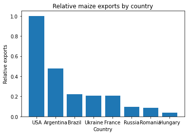

Since their introduction barely a decade ago, Jupyter Notebooks have become an incredibly
popular tool for working interactively with data and code (in particular Python code).
The notebook structure means that compared to an interactive Python session, a lot more
is saved, and results can be presented contextualised by the code that generated them,
and with documentation describing what was done. They are held by many to be a "good thing"
for reproducibility. However, they come with some unique challenges that in some cases
make reproducibility harder rather than easier! In this episode we will look at what
causes some of these challenges, and how we can overcome them.

## Run in order

Something you've probably noticed when working with Jupyter Notebooks is that you can go
back and modify and re-run old cells. Unfortunately, this doesn't recompute all of the
results that had been calculated based on the first run of the cell. This then means that
the notebook can get into an inconsistent state, where some variables have "old" data
and some are up to date. It would be very difficult for another researcher to re-run the
notebook in the same order&mdash;they would need to painstakingly look through the
little numbers Jupyter attaches to the cells after they are run, finding each one
sequentially. And in some cases that wouldn't be sufficient&mdash; for example, if a
cell had been edited since the last time it was run.

As an example, let's look at [spiral.ipynb](../files/spiral.ipynb). Since the second cell
specifies to draw a spiral, we would expect to see one in the output of the third cell,
but instead we see a straight line. Looking carefully, we can see that the second cell
was run _after_ the third cell, so presumably the value of `line_to_draw` was changed.

To avoid this issue, we should always purge the output, restart the kernel, and re-run
our notebooks top-to-bottom once we think our analysis is complete, to ensure that the
notebook is consistent and does indeed give the answers we want. However, this is
laborious, and ideally we would like to automate it. Fortunately, Jupyter gives us a tool
to do it:

~~~
$ jupyter nbconvert --to notebook --execute spiral.ipynb
~~~
{: .language-bash}

The notebook is updated as if we had opened it in the browser and run every cell,
but we never had to leave the command line. This would then allow the notebook to
be called from a shell script, or any other tool we've written to automate our
analysis.

## Stripping output

There are two reasons one might want to commit a Jupyter notebook to a Git repository:

1. To share the results of an analysis, including the code that generated it for
   context. In this case, the output is key and needs to be retained as part of
   the file.
2. To keep track of, or share, the code used, with the intention that others generate
   the output. In this case, the output is in fact a hindrance.

Why is the output a hindrance in a Jupyter notebook in Git? There are a few reasons:
firstly, it makes the file much larger than it needs to be, since there are most likely
images (e.g. plots) in it that will take up much more space than the code. Another is that
time the notebook is run it will change some aspect of the output (e.g. the cell numbers).
This means Git will see the file as changed and suggest we commit it, even if no change
has been made to the code we actually want to track.

Manually clearing the output before quitting each Jupyter Notebook session will avoid this,
but is difficult to remember every time. More convenient is a tool called `nbstripout`,
which is available from `pip`.

~~~
$ pip install nbstripout
~~~
{: .language-bash}

We can now manually strip the output from a notebook with:

~~~
$ nbstripout spiral.ipynb
~~~
{: .language-bash}

If we want to go a step further, we can even get `nbstripout` to attach itself to our
local copy of the repository, and automatically strip notebook as we commit them, so
that we never accidentally commit a notebook with output in.

> ## Git smudge/clean filters
>
> `nbstripout` is an example of a Git clean filter, which silently adjust files
> as they are read into a Git repository. Since different people will have tools
> installed in different places, Git does not pull or push the definitions of filters;
> instead, each person cloning a repository (or each computer you clone it to) will
> need to install the filter to their local copy separately.
>
> More detail on how smudge and clean filters work can be found in
> [this article on RedHat.com][redhat-smudge-clean].
{: .callout}

~~~
$ nbstripout --install
~~~
{: .language-bash}

Of course, if we have a use case where we want to commit notebooks with output, we would
not want to install `nbstripout` in this way. The `nbstripout --install` command only
attaches `nbstripout` to the current repository, so we can be selective about which
repositories get this treatment.

> ## Diff and merge
>
> You may recall that Git has some powerful tools for helping resolve merge conflicts,
> where you and a collaborator have edited the same file at different times.
> The structure of a Jupyter Notebook makes this much harder to resolve than it would
> be for a plain text file. Fortunately, there are is a tool available to help with this,
> called `nbdime`. If you will be collaborating with others on a repository that contains
> Jupyter Notebooks, then reviewing [the documentation for `nbdime`][nbdime] (and installing
> it) is very much recommended!
{: .callout}

> ## More to ignore
>
> When working with Jupyter notebooks, you may have noticed that they
> generate an `.ipynb_checkpoints` directory, that clutters the output
> of `git status`. We can fix that by adding it to our `.gitignore`.
{: .callout}

## Passing arguments to notebooks

Unlike regular Python programs, notebooks can't take command-line arguments. But we've
already discussed in the previous episode that we don't want to have to manually edit
code to set the right parameters for the particular analysis we want to perform.

One way of working around this problem is by using environment variables. These are
a general feature of most operating systems; we can set variables in a shell and have
them accessible within programs running inside that shell.

Environment variables are accessible in Python via the `os.environ` dictionary. By
convention, the names of environment variables are written in all capitals:

~~~
import os

print(os.environ)
~~~
{: .language-python}

Let's say that we would like to adjust the size of the spiral being drawn by
`spiral.ipynb`. We can look for an environment variable called `SPIRAL_MAX_X`, and
if one is found, use that in place of the `20` that we are currently using.
We replace the line `x = np.linspace(0, 20, 1000)` with:

~~~
import os

max_x = float(os.environ.get('SPIRAL_MAX_X', 20))
x = np.linspace(0, max_x, 1000)
~~~
{: .language-python}

The `.get()` method of a dictionary will give us the element corresponding to the key
we passed (`'SPIRAL_MAX_X'`), unless there is no such element, in which case it will
return the second parameter (`20`). Since environment variables are always strings of
text, we then need to convert the result into a number so that Matplotlib understands
it.

To call this with `jupyter nbconvert`, we can add the environment variable definitions
at the start of the line.

~~~
$ SPIRAL_MAX_X=100 jupyter nbconvert --to notebook --execute spiral.ipynb
~~~
{: .language-bash}

This will now give us a much tighter spiral.

## To notebook or not to notebook

Many computational researchers treat notebooks as a tool for data exploration, or
presentation, rather than for reproducibility. They will use notebooks to prototype
and find interesting features, before formalising the analysis that has been done into
a plain `.py` file to make the analysis reproducible. These can then be loaded into
smaller notebooks as modules to present and highlight particular aspects of the results.
If you have the time to do this, it is certainly not a bad workflow, but if you have a
large amount of Jupyter Notebooks containing your entire analysis for a paper or thesis,
then taking that and porting it back to plain Python files may take more time than you
have available, in which case tidying up the notebook and making it more reproducible
in and of itself may be more achievable in the time you have available.

> ## Bringing matters to order
>
> Sanjay is investigating some work by his colleage Prof. Nuss, whose conclusions
> he disagreed with. Prof. Nuss included the following figure in a publication
> draft, which Sanjay is suspicious of.
>
> 
>
> In response to a query from Sanjay, Prof. Nuss provides [the Jupyter notebook that she used to perform the analysis](../files/maizeexports.ipynb).
>
> Sanjay finds that when he runs Prof. Nuss's code, it doesn't give the same plot as
> is included in the paper draft. What has happened to cause this?
>
>> ## Solution
>>
>> The cell to produce the bar plot was run after the cell defining the subsidy areas
>> had been run, without re-running the definition of the countries, meaning that the
>> variable `data` had the wrong contents.
> {: .solution}
>
> How could this error have been avoided?
>
>> ## Solution
>>
>> There's more than one way this could have been avoided:
>>
>> * Prof. Nuss could (and should) make sure to run the notebook end-to-end before
>>   using the output in a publication
>> * Avoiding using the same variable name to represent two different sets of data
>>   would have avoided the problem (as well as potentially making the code easier
>>   to read)
>> * Keeping related data together, for example in a Pandas DataFrame, would avoid
>>   the possibility of part of the data being replaced but the metadata not.
>>   Reading in the data from a file could help with this.
> {: .solution}
{: .challenge}

> ## Commit a notebook
>
> Install `nbstripout` into the `challenge` repository. Add the `maizeexports.ipynb`
> notebook to the repository and commit it; what messages do you see? Has the notebook
> been changed in the working directory?
>
>> ## Solution
>>
>> `nbstripout` works very quietly&mdash;the version of the notebook
>> in your working directory is left unchanged, and no message is given
>> that the committed version has been changed.
> {: .solution}
>
> Now that the notebook is version controlled, do some tidying of the repository:
>
> * Adjust the notebook to output to files rather than the screen
> * Attribute authorship for code that you didn't write
> * Add documentation of what the notebook does
> * Adjust the run instructions to include the new tool
{: .challenge}



[nbdime]: https://nbdime.readthedocs.io/en/latest/
[redhat-smudge-clean]: https://developers.redhat.com/articles/2022/02/02/protect-secrets-git-cleansmudge-filter#
