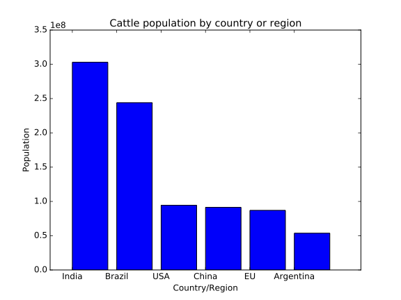

So far, we have focused on getting the code that we have written in to a form where another
researcher can run it in the same way. Unfortunately, this isn't enough to ensure that the
analysis we have done is reproducible. Each of the libraries we rely on in our code is
constantly being developed and updated, as is the Python language, and the operating
system that it runs on. As this happens, the default version to be installed on request
will change. While minor version changes typically do not introduce any incompatibilities,
eventually almost all software needs to introduce changes that break backwards compatibility
in some way in order to develop and improve functionality available to new code.
In the best case this will cause cosmetic changes, and the next best the code will fail
to work at all because some function has been renamed, relocated, or removed. The worst
case is when the code still runs without error, but gives a very different answer to that
obtained with the old version of the library.

To make our analysis fully reproducible, we need to reproduce the entire computational
environment that was used to perform it. In principle, this includes not only the version
of Python and the packages that were installed, but also the operating system and the
underlying hardware! For now, we will focus on reproducing as much of the original
environment as we can.

## Exporting environments with Conda

The Conda package manager used by Anaconda gives a way of exporting the current environment.
This includes more than just Python packages; it also includes the specific Python version,
as well as some dependency packages that would otherwise need to be installed separately.
We can export our Conda environment as:

~~~
$ conda env export -f environment.yml
$ cat environment.yml
~~~
{: .language-bash}

By convention the filename for conda environments is `environment.yml`; this file is in
YAML format. Looking at it, we see it encodes the environment name, the Conda and Pip
packages that we have installed, as well as the path to the environment on our computer.

> ## If you don't use Conda
>
> We have used Conda here because it can define things quite precisely, including the
> version of Python and many external dependencies in addition to the Python packages
> being used. However, if you don't use Conda, you can still export an environment.
>
> The most basic way is built into Pip. Using `pip freeze` will output a list of all
> currently installed Pip packages. While this will not work if you are using Conda,
> since these packages are not available through PyPI, if all your packages were
> instead installed through Pip, then this gives a very commonly-accepted way to
> document your environment. By convention the filename for your list of packages
> is `requirements.txt`.
>
> ~~~
> $ pip freeze > requirements.txt
> ~~~
> {: .language-bash}
>
> Another alternative tool is called [Poetry][poetry]. This combines some of the
> functionality of `pip freeze` with some of the dependency and environment management
> aspects of Conda.
{: .callout}

## Trimming down an environment

We can see that this file is rather long; this is because we have exported the
Anaconda base environment. This comes with a huge array of packages that could be useful
for doing scientific computation. However, it means that it will be a lot of data to
download for anyone who wants to recreate the environment, and a lot of that data will not
be needed as it is packages we haven't used. Instead, let's create a new, clean environment
to export, starting from Python 3.9

~~~
$ conda create -n zipf python=3.9
$ conda activate zipf
~~~
{: .language-bash}

Now, we can install into this environment only the packages that we refer to in our
Zipf code. If we haven't documented all the requirements in the README yet, we can work
out what these are by looking for any `import` statements in our code, and identifying
those that are not either provided by our own code or by the Python standard library.

~~~
$ grep -r --no-filename import bin | sort | uniq
~~~
{: .language-bash}

~~~
from collections import Counter
import argparse
import csv
import matplotlib.pyplot as plt
import pandas as pd
import string
import sys
import utilities as util
~~~
{: .output}

Of these, `collections`, `argparse`, `csv`, `string`, and `sys` are all part of the Python
standard library, and `utilities` is part of our own code. That leaves Matplotlib and Pandas.
Let's install these with Conda:

~~~
$ conda install pandas matplotlib
~~~
{: .language-bash}

If we're using any tools installed without `import`ing them, then they won't be
picked up by `grep`; in that case we need to check through our shell scripts to
see if any commands are being run that need to be installed. If your analysis
includes Jupyter Notebooks, for example, then you will need `jupyter` installed,
even if you don't ever use `import jupyter`.

It's a good idea to do a quick check now that this environment can indeed run our analysis,
in case we've forgotten anything:

~~~
$ bash ./bin/run_analysis.sh
~~~
{: .language-bash}

Let's export the environment again in both formats:

~~~
$ conda env export -f environment.yml
$ cat environment.yml
~~~
{: .language-bash}

These files are now much shorter, so will be much quicker to install.

> ## Spot the difference
>
> Take a look at the following plot of cattle populations by country, which was generated
> by [a Python program using Matplotlib](../files/cattlepopulations.py) on an older
> computer.
>
> 
>
> Try and run the `cattlepopulations.py` file yourself. Does the output you see look the same
> as the one above? If not, why not?
>
>> ## Solution
>>
>> Matplotlib changed its default style set with version 2.0, so the colours of plots made
>> with the default styles changes between the old and new versions. Also, the default
>> behaviour of bar charts is to centre the labels, where to achieve this before you needed
>> to do extra work.
>>
>> This is why we must specify our environment when we share our code&mdash;otherwise,
>> other people will get different results to us. In this case it was just the formatting
>> of a plot, but in some cases it will be the actual numerical results that will differ!
>>
>> As an aside,
>> in fact there have been other changes to bar charts so that they are easier to make.
>> Specifically, the `positions` variable is no longer necessary at all, you can use:
>>
>> ~~~
>> plt.bar(countries, cattle_numbers)
>> ~~~
>> {: .language-python}
>>
>> and achieve the same results as the file above did.
> {: .solution}
{: .challenge}

> ## Containers
>
> A popular, but somewhat more involved, alternative to using these kinds of environment
> is to use _containerisation_, with products such as Docker and Apptainer (previously
> Singularity). This is beyond the scope of what we're covering in this lesson, but
> the Carpentries Incubator provides an excellent
> [lesson on getting started with Docker][incubator-docker] that is worth looking at
> if you are interested.
{: .callout}

> ## Define another environment
>
> Create a new Conda environment with just the packages you need for the `challenge`
> repository, and export an `environment.yml` file. How long
> is this file compared to the one for the base Anaconda environment?
>
>> ## Solution
>>
>> Since this analysis includes running a Jupyter notebook, we need to have Jupyter
>> installed in addition to the packages that are `import`ed in our code.
>>
>> ~~~
>> $ conda create -n challenge
>> $ conda activate challenge
>> $ conda install numpy matplotlib pandas jupyter
>> $ conda env export -f environment.yml
>> ~~~
>> {: .language-bash}
>>
>> The environment for the `challenge` repository's requirements should have around 125
>> lines, while the full Anaconda environment is over 300 lines.
> {: .solution}
{: .challenge}

> ## Using `pip` and `requirements.txt`
>
> Try and create an environment for the `challenge` repository that installs packages
> via `pip` and export it to a `requirements.txt` file.
>
>> ## Solution
>>
>> Firstly, create a new Conda environment with just Python.
>>
>> ~~~
>> $ conda create -n challenge_pip python=3.9
>> $ conda activate challenge_pip
>> ~~~
>> {: .language-bash}
>>
>> Now, install Python packages only using `pip`, not with `conda`.
>>
>> ~~~
>> $ pip install numpy matplotlib pandas jupyter
>> ~~~
~~ {: .language-bash}
>>
>> If your project depended on non-Python packages (for example, recent versions of
>> CMake or GNU Make), then you could still install these from Conda.
>>
>> Now, to export a requirements file:
>>
>> ~~~
>> $ pip freeze > requirements.txt
>> ~~~
>> {: .language-bash}
>>
>> We could still use `conda env export` here to generate an `environment.yml` file, and it
>> would list our packages installed from `pip`, under a specific entry designating that they
>> were installed via `pip`.
> {: .solution}
{: .challenge}



[incubator-docker]: http://carpentries-incubator.github.io/docker-introduction
[poetry]: https://python-poetry.org
