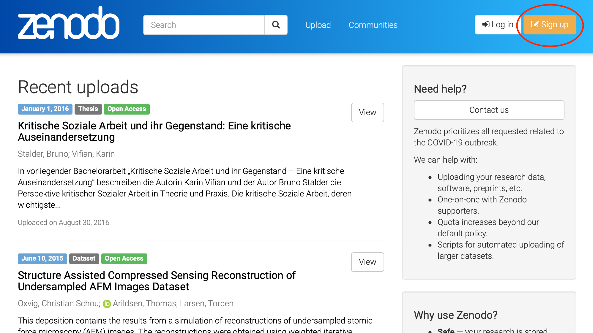
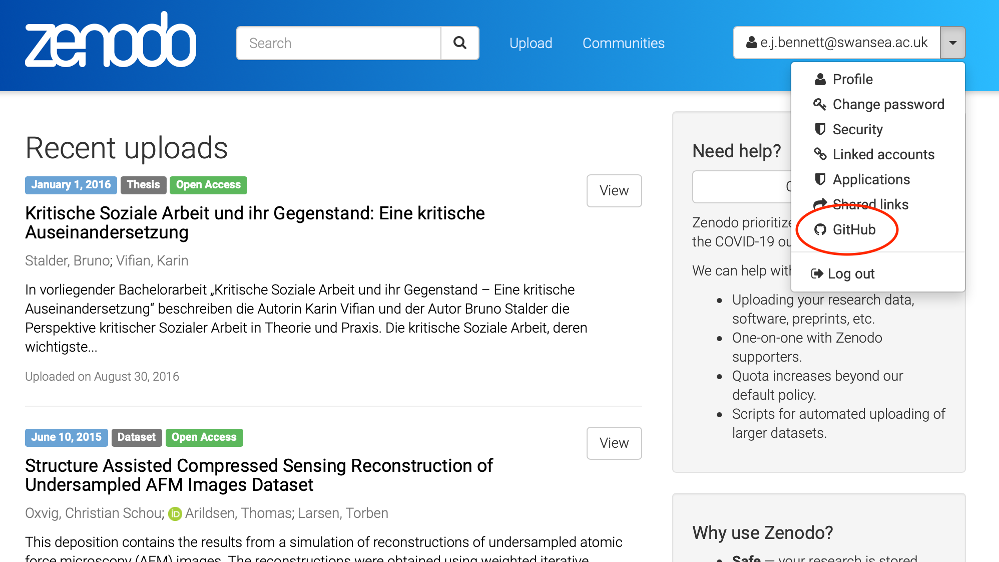
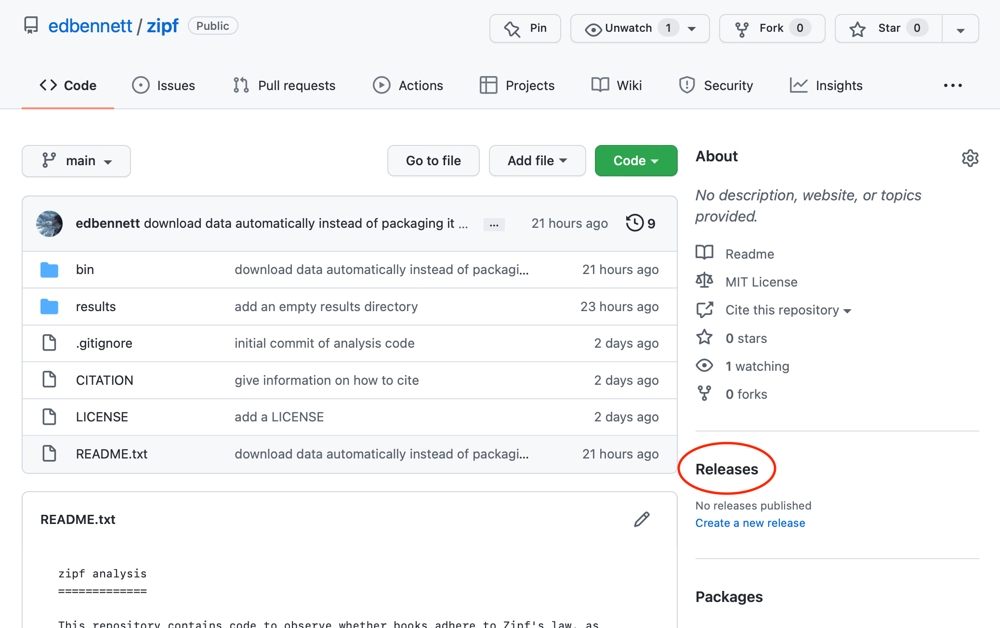

So far we have been working to tidy our repository and make it reproducible, pushing
and pulling work to and from GitHub. However, at the end of any drafting process there
comes a point where you declare the work finished, and make it available as a finalised
version of record&mdash;for a paper this is where you submit to a journal and (hopefully)
have the paper published. Similarly, we would like to make a finalised version of our
code available, to give an indication that:

* The code is finalised, and the version presented is the version used to perform the
  analysis for any publications based on the code. By analogy, we wouldn't link colleagues
  to the online collaborative editable version of our paper instead of publishing in a
  journal.
* The code will be available for the long term. While GitHub has been around for a while,
  it makes no promises as to long-term avaialability. Published academic journals are
  available from decades or centuries ago; drafts and collaborative notes from that
  period are harder to find.
* We would like the code to be treated (and cited) as an academic output. GitHub is
  popular with and well-known among software engineers, but in academic circles it is
  less familiar, or at least is known as a website to get free software from; the idea
  of software (code) being valuable in and of itself is more novel. Having a repository
  similar to the more familiar preprint repositories, and that can assign a DOI to a
  peice of work, will hopefully better align your work as an object worthy of academic
  consideration.

> ## DOI?
>
> DOI, short for Digital Object Identifier, is a type of unique identifier most
> frequently used to identify academic journal articles, but which can also be used
> for other "digital objects", including data sets as well as, for example, official
> publications of the European Union. It is designed to be more permanent
> than a URL, since internet locations may change over time as journals or their
> publishers change names. They can look like `doi:NNNN.MM/XXX` where `NNNN`, `MM`, and
> `XXX` are numbers; they can also be formatted as `https://doi.org/NNNN.MM/XXX`. The
> latter can be entered into a browser, and `doi.org` will always redirect to the
> current location of the object.
{: .callout}

## Publish in a data repository

One good option for publishing code is to use a data repository. There is a wide
range of data repositories available, many of which are specialist towards particular disciplines. Many potential venues for publishing software (and many other digital
services to enable open science) can be searched at the [European Open Science Cloud][eosc].
It's also possible that your institution hosts its own data repository,
and/or mandates a specific one. Your institution's Open Access policy, if it has one,
should have more detail on this.

Today we'll look at a general-purpose data repository called
[Zenodo][zenodo]. Zenodo is hosted by CERN (the European Centre for Nuclear Research
in Geneva), and is part of the same infrastructure that manages the collossal amounts
of data generated by the Large Hadron Collider. The computing resources supporting it
have operational plans and budgets reaching decades into the future, which is about as
long-term as any services currently operate on.

> ## Keep your tests separate from your real data
>
> Because Zenodo is designed to keep research data safe for the long term, it's
> not a good idea to upload test or toy data to it. For that reason, for
> this lesson we'll be using the ["sandbox" version of Zenodo][zenodo-sandbox].
> This behaves exactly like [the real version][zenodo], but is regularly purged
> of new datasets, and isn't where you should publish your actual research outputs!
> Remember to go to [the real Zenodo][zenodo] once you're ready to publish your
> research.
{: .callout}

To publish on Zenodo (and Zenodo Sandbox), we first need to create an account. 

While
this can be done manually, the quickest way for our purposes is to log in using GitHub.
This will connect our GitHub account with our Zenodo account. If you have one, you can
also link your ORCID to your Zenodo account, so that your publications on Zenodo are
easier to tie back to your work in other venues.

Once we are signed up and logged into Zenodo (Sandbox), we can use the drop-down next
to our email address at the top-right to select the GitHub option.

This gives us a
three-step process to publish our repository to Zenodo. Firstly, out of the list of
repositories presented (found from our GitHub account), we choose which we want to publish
to Zenodo. Let's do that now for the `zipf` repository.

Once this is done, we need to create a "release" of our code on GitHub. 

To do this, we
can click through from the repository home page to the Releases page, and from there
click the "Create a new release" button. The form to create a new release requests some
information

* Choose a tag: If you use tags in your repository, you can choose which tagged commit
  should be released. If not, then GitHub can automatically create a tag for you when
  you publish the release.
* Target: this should be the branch that you are releasing from. This will most likely
  be the `main` branch.
* Release title: This should be a version name for the particular release. This is
  designed for software that gets regular releases, or at least more than one in its
  lifetime. For a piece of data analysis code that is specific to one publication, it
  is enough to use `v1.0.0` here.
* Describe the release: Some more discussion of the release can in principle go here.
  Note that this is describing the _release_, not the code&mdash;the code (and underlying
  research) should be discussed in the README. This is again more useful when you are
  releasing multiple times; each release should use the description to outline the changes
  included since the previous release.
* Attach binaries: We can ignore this; if we were publishing software written in a
  language like C or Fortran, and that we wanted others to be able to install, we could
  attach the compiled versions of the program here.

Once we have filled out the form, we can click Publish, and Zenodo (or the Sandbox) will
pick up that we have created a release, and will create a corresponding data publication.
It will also then create a DOI, which you can add to the bibliography of any papers that
use results generated by the code.

The third step suggested by Zenodo is to add a badge to our README. Since we have used
plain text for our README, that will not work, but if you were using Markdown, you could
copy and paste the code generated by Zenodo to add the DOI of the repository, so that
readers arriving to the GitHub repository page are aware that they can cite the code
via DOI as well.

## Alternatives publishing routes

For tools that can be applied more broadly, there are some alternative routes to
publication (that can be used instead of or in addition to Zenodo).

1. Publish a package. Depending on the venue, this may or may not aid citability.
   For example, publishing a Pip package will not enable citation, but publishing to
   [WorkflowHub][workflowhub] publicly will create a DOI.
2. Publish a paper. There are publications that specifically enable promotion and
   constructive peer review of research software. The [Journal of Open Source Software][joss]
   connects to GitHub similarly to Zenodo, but requires a very short "paper"
   explaining the context of what the software does. This allows you to get some
   feedback from other computational researchers on your code.

> ## Home turf
>
> Try and find your own institution's policy on open access. Does it have a
> local repository for source code (or research data more generally), or
> recommendations on where to publish it?
{: .challenge}

> ## Fitting in
>
> Are there any discipline-specific repositories for data or code that are in
> use in your discipline?
>
> Discuss with a neighbour, or in breakout rooms.
{: .challenge}

> ## Versioning
>
> Wei published the analysis code for his last publication about bat biomechanics
> on Zenodo. Now he has prepared a new paper about squirrel biomechanics, making
> use of a lot of the same code, but with some modifications to make it applicable
> to squirrels rather than bats. He is wondering how best to publish this modified
> code. What would be the best option for Wei?
>
> 1. Publish the new version of the code entirely separately, with
>    a citation to the bat code.
> 2. Publish the new version of the code entirely separately, with no mention of
>    the bat code.
> 3. Create a new version of the previous published code on Zenodo, and update
>    the metadata to indicate that the code is now squirrel-specific.
> 4. Keep the updated code on GitHub, but keep citing the DOI for the bat version
>    of the code, since it links back to GitHub where the updated code is.
> 5. Something else?
{: .challenge}

> ## Publish the challenge
>
> Enable preservation of the `challenge` repository in the Zenodo Sandbox. Create
> a new release, and get the DOI from Zenodo.
{: .challenge}

## What next?

In this lesson we have focused primarily on taking a piece of code that has already been
written and adjusting it to prepare it for publication. Of course, as you do this, your
habits in writing software will change so that for future publications the workload is
less&mdash;perhaps you keep things in Git from the start, choose a directory structure,
and write a README as you progress through your work. As you gain experience, the
process of publishing your analysis code will become second-nature.

If you do continue down this road, you might find it useful to have tools that nudge you
towards a neater structure from the moment you start your project. One such tool that is
also popular with professional software engineers is called [Cookiecutter][cookiecutter];
this gives you access to a variety of project templates that are appropriate for
particular types of project. In particular, there is a
[Cookiecutter template for data science][cookiecutter-datascience] that will give you
a project structure similar to the one we have discussed in this lesson (along with
some other suggestions that we haven't had time to cover).



[cookiecutter]: https://cookiecutter.readthedocs.io
[cookiecutter-datascience]: https://drivendata.github.io/cookiecutter-data-science/
[eosc]: https://eosc-portal.eu
[joss]: http://joss.theoj.org/
[workflowhub]: https://workflowhub.eu
[zenodo-sandbox]: https://sandbox.zenodo.org
[zenodo]: https://zenodo.org
